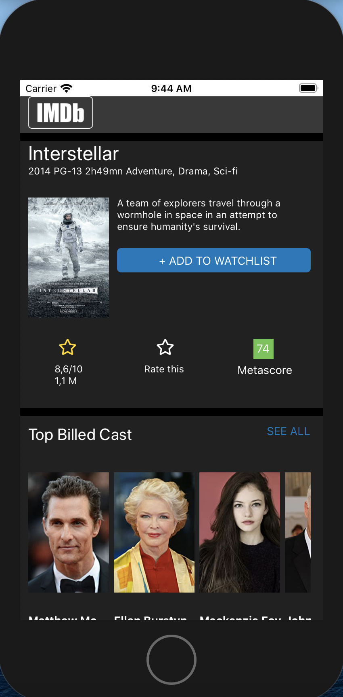

# Copie de page IMDB

Il s'agit ici d'un premier projet utilisant React Native avec la copie d'une page IMDB pour bien prendre en main le scrolling horizontal et vertical ainsi que l'utilisation des feuilles de style.
Cette page a été réalisée lors de la formation avec Le Réacteur.

## Démarrage

Pour lancer le projet :
npm install

ou :
yarn

Une fois l'installation terminée :
expo start

## Screenshot

     </img> 

